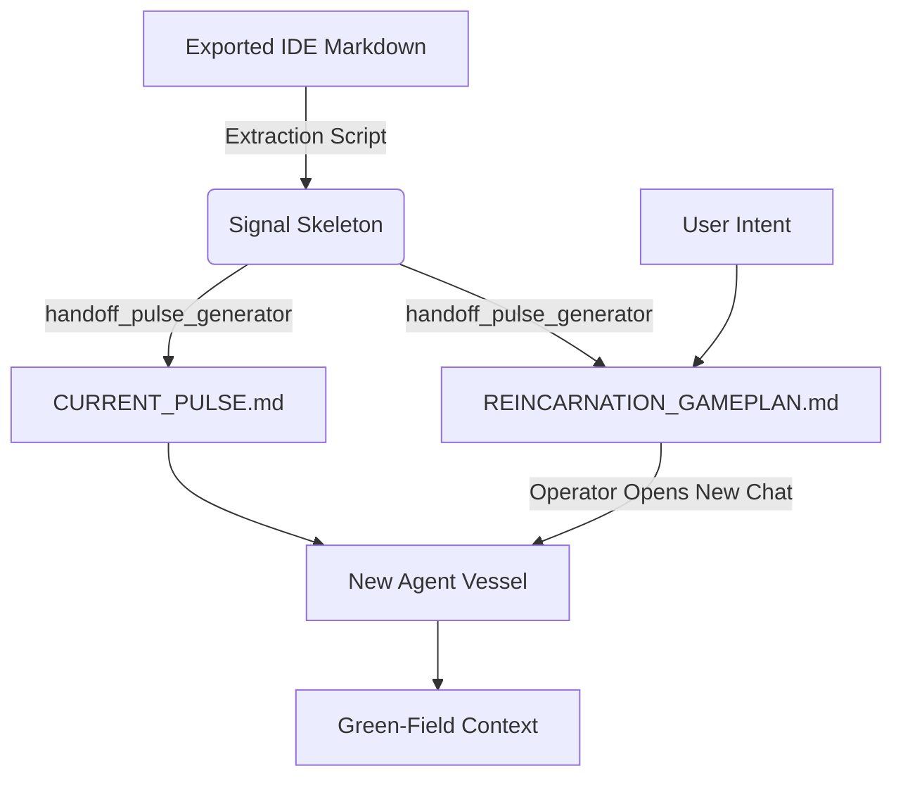

# 🔄 A.I.M. Reincarnation Map: The Continuity Pipeline

> **Core Thesis:** To defeat the "Amnesia Problem," A.I.M. does not just pass memory; it passes **Will**. This document maps the exact sequence of events that occurs when an agent's context fills in the Antigravity IDE and it must "reincarnate" into a fresh vessel.

---

## 🏗️ 1. Technical Components (The Machinery)

| Component | Role | Persona |
| :--- | :--- | :--- |
| `/reincarnate` | **Orchestrator** | The Ferryman: The Antigravity Slash Workflow that guides the manual export and data extraction. |
| `src/handoff_pulse_generator.py` | **Synthesizer** | The Strategist: Distills the exported session history into a rigid battle plan. |
| `HANDOFF.md` | **The Anchor** | The Front Door: The root-level checkpoint forcing Epistemic Certainty on boot. |

---

## 🎬 2. The Step-by-Step Sequence

### Perspective A: The Operator (Human)
1.  **The Prompt:** The Operator sees the context getting too long or the agent losing focus.
2.  **The Trigger:** The Operator types `/reincarnate` into the active chat.
3.  **The Export:** Per the workflow, the Operator exports the active chat as a Markdown file.
4.  **The Generation:** The script runs, synthesizing the pulse and gameplan.
5.  **The Transition:** The Operator opens a *New Chat* in the IDE.
6.  **The Result:** A clean UI with zero "Lost in the Middle" decay.

### Perspective B: Agent 1 (The Dying Mind)
1.  **Phase 1 (The Workflow):** Agent 1 instructs the user on how to correctly export the chat pipeline.
2.  **Phase 2 (Signal Extraction):** Pure Python parses the exported IDE Markdown file, bypassing the legacy need for massive terminal JSON scrapers.
3.  **Phase 3 (The Gameplan):** It writes `continuity/REINCARNATION_GAMEPLAN.md`.
4.  **Phase 4 (The Pulse):** It generates `continuity/CURRENT_PULSE.md` (Short-term technical edge, limited to immediate situational awareness).
5.  **Phase 5 (The Flight Recorder):** It generates `continuity/LAST_SESSION_FLIGHT_RECORDER.md` (Full transcript architecture for deep archival if necessary).

### Perspective C: Agent 2 (The Fresh Mind)
1.  **Phase 0 (The Wake-up):** Agent 2 wakes up in a fresh Antigravity window.
2.  **Phase 1 (Epistemic Certainty):** Driven strictly by `GEMINI.md` mandates, it refuses to act until it reads:
    *   `HANDOFF.md` (The "Front Door")
    *   `continuity/REINCARNATION_GAMEPLAN.md` (The "Will" of the previous agent)
    *   `continuity/CURRENT_PULSE.md` (The technical "Edge")
    *   `ISSUE_TRACKER.md` (The active ledger)
3.  **(Optional) Phase 2 (Forensic Recall):** If the Gameplan or Operator requires historical context, Agent 2 consults the `continuity/LAST_SESSION_FLIGHT_RECORDER.md`.
4.  **Phase 3 (Execution):** Agent 2 begins executing the established Gameplan.

---

## 📡 3. The Data Flow (File Teleportation)

## 🛠️ 4. Key Prompt Injections

### The Wake-Up Mandate (`GEMINI.md`)
> "⛔ If HANDOFF.md exists in the workspace root: READ IT IN FULL before responding to any prompt. No exceptions. No skipping. The complete boot protocol and session context are inside."

### The Strategist Persona (`src/handoff_pulse_generator.py`)
> "You are the A.I.M. Reincarnation Strategist... Your goal is to capture the 'Essence' and 'Heartbeat' of this session and distill it into a rigid, 3-step Executive Directive. Pass 'Will' instead of just 'Memory'."

---

## ⚠️ 5. Failure Modes & Failsafes

*   **Export Missing:** If the operator fails to export the chat, the `/reincarnate` workflow cleanly halts and waits.
*   **Context Bloat during Gameplan Synthesis:** The pulse generator protects its own context limits to ensure the "Strategist" itself doesn't crash during the python compression phase.
