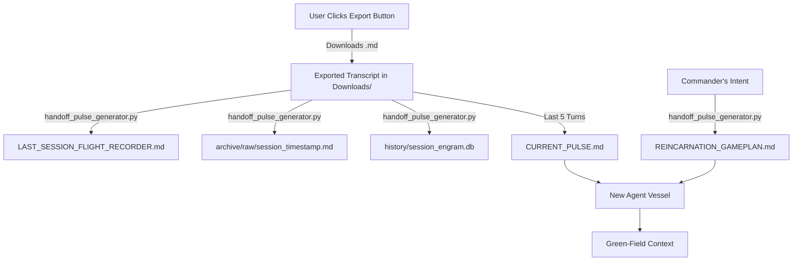

# 🔄 A.I.M. [Reincarnation](Feature-Reincarnation-Gameplan.md) Map: The Continuity Pipeline

> **Core Thesis:** To defeat the "Amnesia Problem," A.I.M. does not just pass memory; it passes **Will**. This document maps the exact sequence of events that occurs when an agent's context fills and it must "reincarnate" into a fresh vessel.

> **⚠️ Antigravity-Native Architecture:** This pipeline has been fully adapted to operate within the Antigravity IDE. The legacy `tmux`-based terminal splicing and raw JSON scraping have been replaced by a human-in-the-loop Export mechanism combined with zero-token Python parsing.

---

## 🏗️ 1. Technical Components (The Machinery)

| Script | Role | Persona |
| :--- | :--- | :--- |
| `.agents/workflows/reincarnate.md` | **Orchestrator** | The Ferryman: Manages the `/reincarnate` workflow, the mandatory Export prompt, and triggers the Python pipeline. |
| `src/handoff_pulse_generator.py` | **Synthesizer** | The Strategist: Parses the exported `.md` transcript from `Downloads/`, generates the Gameplan, Pulse, Flight Recorder, and session archive. **100% zero-token.** |
| `scripts/extract_signal.py` | **Noise Filter** | The Harvester: Contains `extract_signal_from_txt()` to strip disclaimer headers and tool noise from the exported Antigravity markdown transcript. |
| `scripts/auto_export.py` | **UI Hook (Experimental)** | The Clicker: Attempts `pywinauto`/`uiautomation` to auto-click the Export button. Currently blocked by Chromium's stripped `aria-label` arrays. Falls back to manual export. |

---

## 🎬 2. The Step-by-Step Sequence

### Perspective A: The Operator (Human)
1.  **The Trigger:** The Operator types `/reincarnate <Commander's Intent>` in the Antigravity chat.
2.  **The Mandatory Pause:** The agent halts and displays: *"⚠️ Please click the **Export** button at the top of this chat window to download the transcript. Reply **Proceed** or **Cancel**."*
3.  **The Export:** The Operator clicks the Export button at the top of the conversation, saving the `.md` transcript to `C:\Users\kingb\Downloads\`.
4.  **The Proceed:** The Operator replies `Proceed`.
5.  **The Transition:** The agent executes the Python pipeline, then instructs the Operator to close the tab and open a fresh Antigravity session.

### Perspective B: Agent 1 (The Dying Mind)
1.  **Phase 0 (The Pause):** Agent 1 freezes all execution and prompts for the manual Export.
2.  **Phase 1 (Pipeline Execution):** Upon receiving `Proceed`, it runs `python src/handoff_pulse_generator.py "<Commander's Intent>"`.
3.  **Phase 2 (Dual Extraction — Zero Token):** The Python script mechanically:
    *   Hunts the newest `.md` file in `Downloads/`.
    *   Copies the full transcript to `continuity/LAST_SESSION_FLIGHT_RECORDER.md`.
    *   Archives a timestamped copy to `archive/raw/session_<timestamp>.md`.
    *   Ingests all conversational turns into `history/session_engram.db` (SQLite, columns: `id, session_id, timestamp, role, content`).
    *   Extracts the **last 5 turns** and writes them to `continuity/CURRENT_PULSE.md`.
    *   Formats `continuity/REINCARNATION_GAMEPLAN.md` from the Commander's Intent parameter.
4.  **Phase 3 (Self-Termination):** Agent 1 instructs the Operator to close the IDE tab.

### Perspective C: Agent 2 (The Fresh Mind)
1.  **Phase 0 (The Wake-up):** Agent 2 wakes up in a fresh Antigravity chat window.
2.  **Phase 1 (Epistemic Certainty):** It refuses to act until it reads:
    *   `GEMINI.md` (Operating Rules — auto-loaded via KI system)
    *   `HANDOFF.md` (The "Front Door")
    *   `continuity/REINCARNATION_GAMEPLAN.md` (The "Will" of the previous agent)
    *   `continuity/CURRENT_PULSE.md` (The technical "Edge")
3.  **(Optional) Phase 2 (Forensic Recall):** If the Gameplan or Operator requires historical context, Agent 2 consults the `continuity/LAST_SESSION_FLIGHT_RECORDER.md` (full exported transcript).
4.  **(Optional) Phase 3 (Deep Memory):** For NITH (Needle In The Haystack) queries about older sessions, Agent 2 can search `history/session_engram.db` via `aim search`.
5.  **Phase 4 (Execution):** Agent 2 begins the first task.

---

## 📡 3. The Data Flow (File Teleportation)

## 🛠️ 4. Key Architecture Notes

### Why Manual Export? (The Antigravity Security Wall)
Antigravity locks all conversation data inside proprietary `.pb` (Protocol Buffer) binary files. The following zero-token extraction methods were exhaustively tested and **all failed**:
1. `overview.txt` — Does not exist on disk during active sessions.
2. Protobuf decode (`blackboxprotobuf`) — Encrypted/framed payloads, Wire Type 6 error.
3. Electron SQLite (`state.vscdb`) — Chat history obfuscated.
4. MITM Proxy (`mitmproxy`) — IDE daemon bypasses OS-level `HTTPS_PROXY` variables entirely.
5. `pywinauto` UI Automation — Chromium strips `aria-label` accessibility attributes from Export button.

**The Export button is the only viable extraction point.** It produces a perfectly clean `.md` transcript that eliminates ~100 lines of legacy JSON parsing logic from `extract_signal.py`.

### The Dual-Extraction Pipeline
The exported `.md` is consumed by `handoff_pulse_generator.py` which performs **two** simultaneous operations:
1. **Pipeline 1 (Archive):** Full raw transcript → `archive/raw/` + row-by-row ingestion into `history/session_engram.db`.
2. **Pipeline 2 (Pulse):** Last 5 conversational turns → `continuity/CURRENT_PULSE.md`.

---

## ⚠️ 5. Failure Modes & Failsafes

*   **User Forgets to Export:** The `/reincarnate` workflow explicitly halts and demands the Export click before proceeding. If the user types `Cancel`, the handoff is aborted gracefully.
*   **No `.md` in Downloads:** If `handoff_pulse_generator.py` cannot locate a recent `.md` file in the Downloads folder, it prints a clear warning and aborts without corrupting existing continuity files.
*   **Session Crash (No Clean Reincarnation):** If the Antigravity session crashes before `/reincarnate` is triggered, the Operator must manually export the session (if possible) or rely on the previous session's continuity files. The `LAST_SESSION_FLIGHT_RECORDER.md` from the *prior* clean handoff remains intact on disk.
*   **Context Bloat during Gameplan:** The pulse generator only reads the last 50k characters of the session history to prevent the Python parser from running out of memory on extremely large sessions.

---

## 🔮 6. Future Option: Automated Export via Extension

> [!NOTE]
> **Status:** Shelved. Documented here so future agents don't waste cycles re-investigating.

The [Antigravity Automation](https://open-vsx.org/extension/joecodecreations/antigravity-automation/1.5.0) extension (by JoeCodeCreations, $4.99–$9.99) injects a local communication bridge into the Antigravity IDE:
- **REST API** (`localhost:5000`): `POST /send_command`, `POST /start-new-chat`, `GET /stats`, etc.
- **WebSocket** (`localhost:9812`): Streams real-time chat content as `{"title": "...", "content": "..."}`
- **Python SDK:** `pip install antigravity-automation`

This would eliminate the manual Export bottleneck entirely — `/reincarnate` could grab chat content via the API, zero clicks. It would also enable live session scraping for the memory pipeline (Issue #26) and external prompt injection for Swarm orchestration.

**Why it's shelved:**
1. Paid extension ($10 for the Remote Control tier).
2. Creates IDE vendor lock-in — `aim-claude`, `aim-codex`, `aim-vscode` would still need the file-based fallback.
3. Building an open-source equivalent requires cracking the WebView sandbox, which has already been attempted and failed (see failed methods above).

**If revisited:** The hybrid approach is recommended — use the extension API when available, fall back to manual Export when not. This preserves cross-IDE portability.

