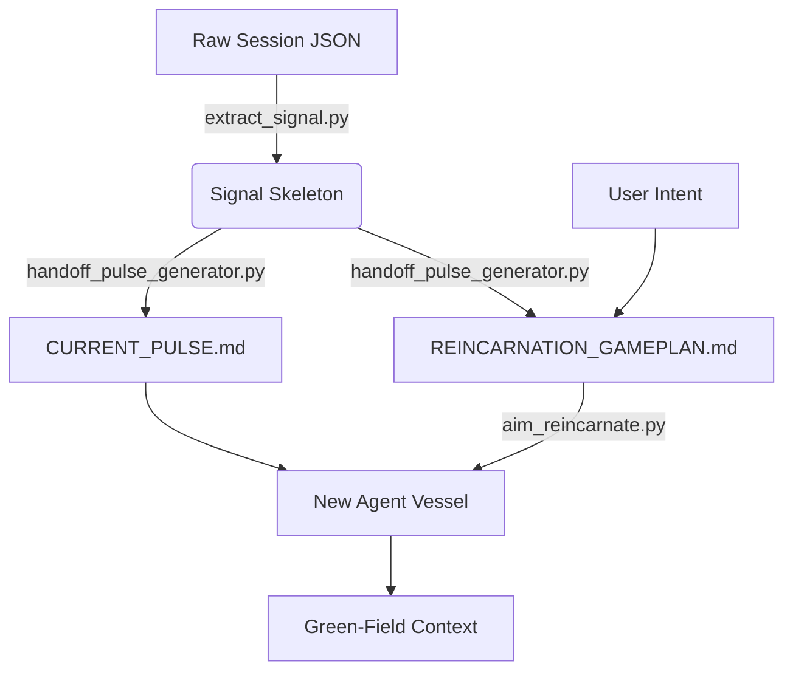

# 🔄 A.I.M. [Reincarnation](Feature-Reincarnation-Gameplan.md) Map: The Continuity Pipeline

> **Core Thesis:** To defeat the "Amnesia Problem," A.I.M. does not just pass memory; it passes **Will**. This document maps the exact sequence of events that occurs when an agent's context fills and it must "reincarnate" into a fresh vessel.

---

## 🏗️ 1. Technical Components (The Machinery)

| Script | Role | Persona |
| :--- | :--- | :--- |
| `scripts/aim_reincarnate.py` | **Orchestrator** | The Ferryman: Manages the `tmux` vessel and the final state teleportation. |
| `src/handoff_pulse_generator.py` | **Synthesizer** | The Strategist: Distills the session history into a rigid battle plan. |
| `scripts/extract_signal.py` | **Noise Filter** | The Harvester: Strips 85% of terminal noise to extract the "Signal Skeleton." |
| `hooks/session_summarizer.py` | **Memory Refiner** | The Archivist: Identifies "Eureka" moments and updates the project state. |

---

## 🎬 2. The Step-by-Step Sequence

### Perspective A: The Operator (Human)
1.  **The Prompt:** The Operator sees the "Context Fade Detected" warning.
2.  **The Injection:** The Operator provides "Commander's Intent."
3.  **The Transition:** The terminal flashes, and the new agent wakes up.
4.  **The Result:** A clean UI with zero "Lost in the Middle" decay.

### Perspective B: Agent 1 (The Dying Mind)
1.  **Phase 0 (Detection):** Agent 1 monitors token usage.
2.  **Phase 1 (Signal Extraction):** It runs `extract_signal.py`.
3.  **Phase 2 (The Gameplan):** It writes `continuity/REINCARNATION_GAMEPLAN.md`.
4.  **Phase 3 (The Pulse):** It generates `continuity/CURRENT_PULSE.md` (Short-term technical edge, limited to 10 turns).
5.  **Phase 4 (The Flight Recorder):** It generates `continuity/LAST_SESSION_FLIGHT_RECORDER.md` (Full noise-reduced session history).
6.  **Phase 5 (Teleport):** It executes the `tmux` self-termination and spawns the successor.

### Perspective C: Agent 2 (The Fresh Mind)
1.  **Phase 0 (The Wake-up):** Agent 2 wakes up in a fresh `tmux` pane.
2.  **Phase 1 (Epistemic Certainty):** It refuses to act until it reads:
    *   `GEMINI.md` (Operating Rules)
    *   `HANDOFF.md` (The "Front Door")
    *   `continuity/REINCARNATION_GAMEPLAN.md` (The "Will" of the previous agent)
    *   `continuity/CURRENT_PULSE.md` (The technical "Edge")
    *   `ISSUE_TRACKER.md` (The task list)
3.  **(Optional) Phase 2 (Forensic Recall):** If the Gameplan or Operator requires historical context, Agent 2 consults the `continuity/LAST_SESSION_FLIGHT_RECORDER.md`.
4.  **Phase 3 (Execution):** Agent 2 begins the first task.

---

## 📡 3. The Data Flow (File Teleportation)

## 🛠️ 4. Key Prompt Injections

### The Wake-Up Mandate (`scripts/aim_reincarnate.py`)
> "Wake up. MANDATE: 1. Read GEMINI.md and acknowledge your core constraints. 2. Read HANDOFF.md. 3. You must read continuity/REINCARNATION_GAMEPLAN.md, continuity/CURRENT_PULSE.md, and ISSUE_TRACKER.md before taking any action or responding."

### The Strategist Persona (`src/handoff_pulse_generator.py`)
> "You are the A.I.M. [Reincarnation](Feature-Reincarnation-Gameplan.md) Strategist... Your goal is to capture the 'Essence' and 'Heartbeat' of this session and distill it into a rigid, 3-step Executive Directive. Pass 'Will' instead of just 'Memory'."

---

## ⚠️ 5. Failure Modes & Failsafes

*   **Tmux Missing:** If `tmux` is not found, the script falls back to a manual handoff, printing the session ID and asking the user to manually attach.
*   **Context Bloat during Gameplan:** The pulse generator only reads the last 50k characters of the session history to ensure the "Strategist" itself doesn't crash during synthesis.
*   **V8 Crash:** If the underlying Node.js engine crashes before `aim_reincarnate` triggers, the user runs `aim crash`. This invokes `extract_signal` on the *last saved snapshot* to reconstruct the pulse from the wreckage.
